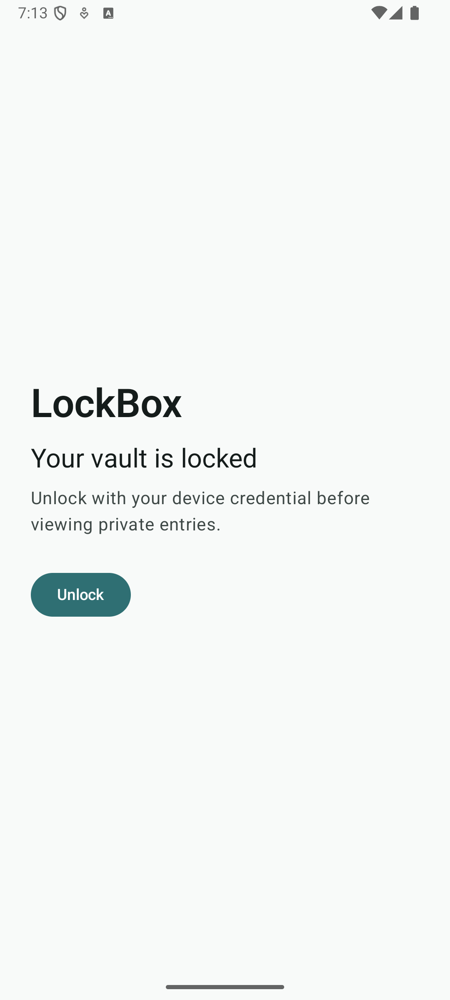
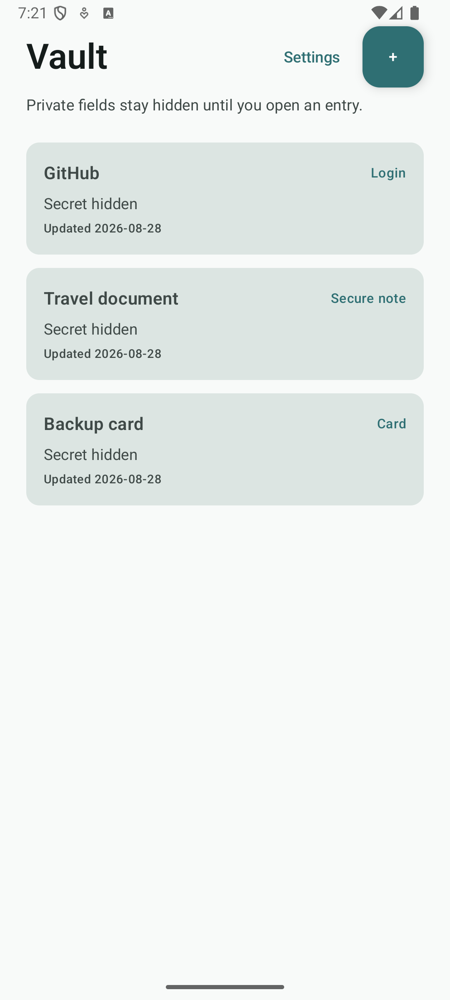
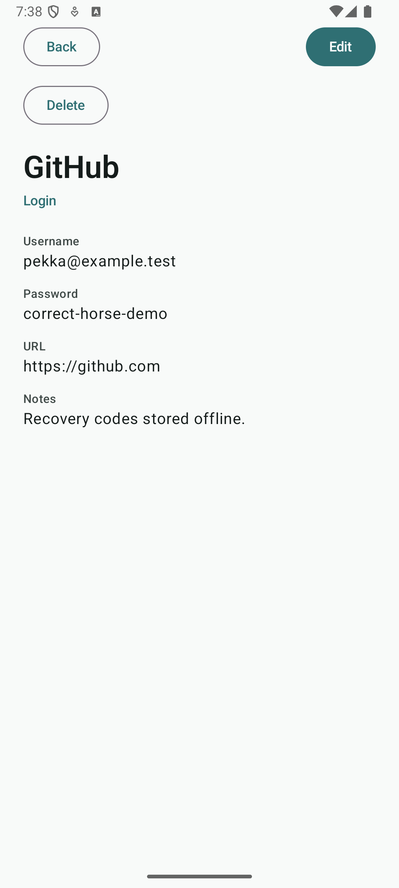
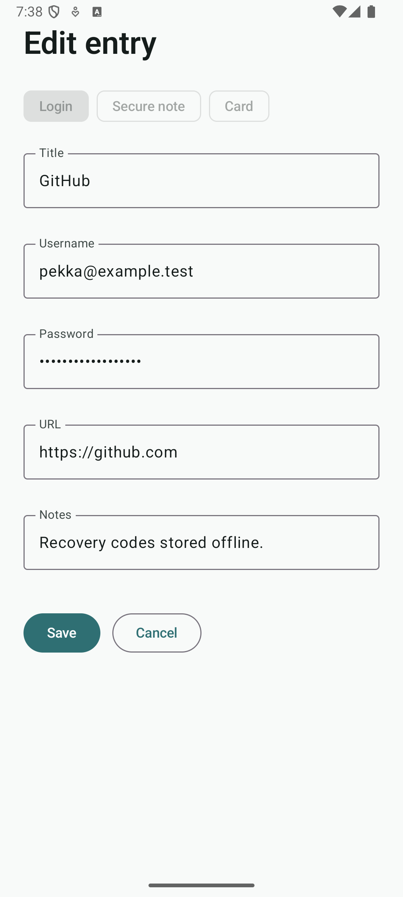

# LockBox

`LockBox` is a local-first Android vault showcase app built with Kotlin and Jetpack Compose.

It demonstrates a privacy-focused Android architecture: biometric/device-credential unlock, an in-memory app session, Room-backed metadata, Android Keystore-backed AES-GCM encryption for secret payloads, relock-on-background behavior, and UI tests around the main security boundaries.

## Screenshots

These screenshots use a debug-only in-memory demo vault. The normal app path uses the real Room/Keystore repository and applies `FLAG_SECURE`, so real vault content is blocked from screenshots and recents thumbnails.

| Lock | Vault |
| --- | --- |
|  |  |

| Detail | Editor |
| --- | --- |
|  |  |

## Feature Summary

- Launches locked on every cold process start.
- Unlocks with AndroidX `BiometricPrompt` using `BIOMETRIC_STRONG | DEVICE_CREDENTIAL`.
- Relocks when the process backgrounds through `ProcessLifecycleOwner`.
- Supports login, secure note, and card entries.
- Keeps list rows redacted; secret fields are only shown on unlocked detail screens.
- Persists metadata and encrypted payloads in separate Room tables.
- Saves, updates, and deletes metadata plus ciphertext through transactional DAO operations.
- Handles unavailable authentication, validation failures, corrupt payloads, save failures, and delete failures.
- Applies haptics for meaningful unlock/save/delete/validation outcomes.
- Adds accessibility labels for unlock, editor, detail, and destructive actions without exposing list secrets.

## Architecture

- Kotlin
- Jetpack Compose
- Material 3
- Navigation Compose
- `StateFlow` and coroutine-backed UI state
- Room for local metadata and ciphertext storage
- Android Keystore AES-GCM for secret payload encryption
- AndroidX Biometric for unlock
- Manual `LockBoxAppContainer` wiring instead of Hilt for the V1 app size

The project is organized by responsibility:

- `app/` owns top-level navigation and dependency wiring.
- `core/security/` owns biometric availability, authentication, lock session state, and lifecycle relock.
- `core/crypto/` owns Android Keystore encryption/decryption contracts and implementation.
- `data/local/` owns Room entities, DAO operations, and payload serialization.
- `data/repository/` maps Room plus crypto into the app-owned `VaultRepository`.
- `domain/` owns vault models and validation.
- `feature/` owns the lock, vault, editor, detail, and settings screens.

## Security Notes

This is a showcase local vault, not a certified password manager.

- The app intentionally declares no Internet permission.
- Android backup and device-transfer extraction are disabled for vault data.
- The app cold-starts locked and keeps unlocked state only in memory.
- `FLAG_SECURE` is applied for the normal app window to block screenshots and recents thumbnails.
- Metadata stores only entry ID, title, type, and timestamps.
- Secret payloads are versioned, serialized explicitly, and encrypted before storage.
- AES-GCM uses a fresh 12-byte IV per encryption and entry/version associated data.
- V1 does not make the Keystore key authentication-bound. BiometricPrompt protects the app session, while Keystore plus the app sandbox protect data at rest.
- Crypto and payload-decoding failures fail closed; the UI shows an unavailable/corrupt state instead of substituting empty secrets.

## Build And Test

```bash
./gradlew :app:testDebugUnitTest :app:assembleDebug :app:compileDebugAndroidTestKotlin
```

Run device/emulator coverage with an unlocked Android user:

```bash
./gradlew :app:connectedDebugAndroidTest
```

The connected-test task has a preflight check that fails early when the selected emulator/device user is still `RUNNING_LOCKED`.

## Manual QA

Use an emulator or device with a screen lock configured.

1. Cold start the app and confirm the lock screen appears before vault content.
2. Tap Unlock and complete the system prompt; the app should show the empty vault.
3. Relaunch the app and cancel the system prompt; the app should stay locked and show a canceled message.
4. Unlock, background the app, then reopen it; the app should return to the locked screen.
5. Test on a profile without an enrolled credential; the unlock button should be disabled with the unavailable explanation.
6. Unlock, add a login, secure note, and card entry; each save should return to the redacted vault list.
7. Open each entry from the list and confirm the detail screen shows secret fields only after unlock.
8. Edit an existing entry and confirm the updated title appears in the list while secret fields remain hidden there.
9. Delete an entry from the detail screen, cancel once, then confirm deletion and verify the list updates.
10. From both detail and editor, relock the app by backgrounding or ending the session; the app should return to the lock screen and discard unsaved editor input.

Device test notes:

- Restart persistence QA passed on `2026-08-20` using `emulator-5554` / `Medium_Phone_API_36.0`.
- Connected Compose/instrumentation coverage passed 27/27 tests on `2026-08-28` using `emulator-5554` / `Medium_Phone_API_36.0`.
