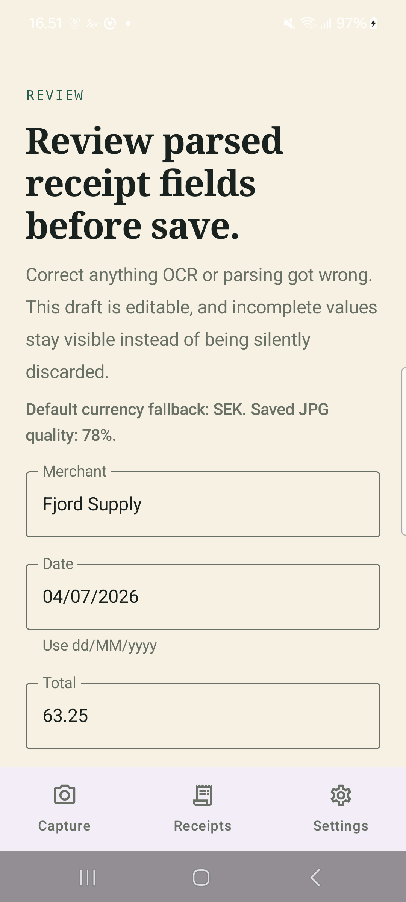
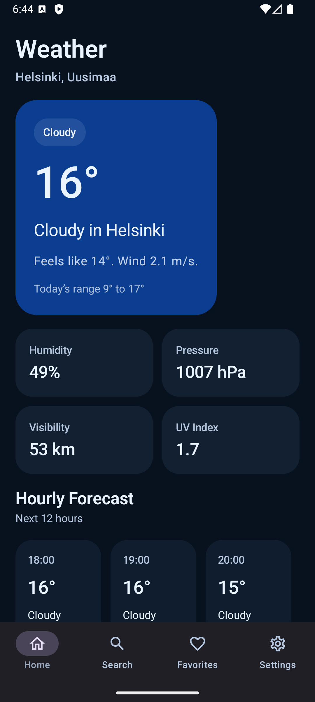
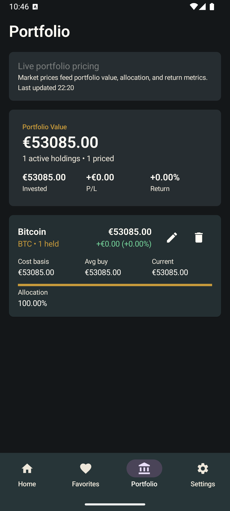

# Android Showcase Apps

A collection of product-sized Android applications demonstrating modern Kotlin, Jetpack Compose, device APIs, local persistence, security, networking, widgets, and automated testing.

The strongest projects are presented first. Active development and earlier learning work are labeled separately so reviewers can distinguish finished portfolio apps from work that is still being shaped.

## Visual Preview

Representative screens from the completed showcase apps:

<p>
  <a href="LockBox/README.md"></a>
  <a href="SnapReceipt/README.md"></a>
  <a href="Weatherly/README.md"></a>
  <a href="CryptoApp/README.md"></a>
</p>

## Projects

| Project | Status | Product Summary | Android Topics |
| --- | --- | --- | --- |
| [LockBox](LockBox/README.md) | Portfolio-ready | Local-first vault with biometric/device-credential unlock, encrypted secret payloads, redacted list states, and lifecycle relock behavior. | Kotlin, Compose, Material 3, AndroidX Biometric, Android Keystore AES-GCM, Room, Navigation, connected tests |
| [SnapReceipt](SnapReceipt/README.md) | Portfolio-ready | Receipt capture workflow that scans or imports images, runs on-device OCR, parses editable drafts, and stores reviewed receipts locally. | CameraX, ML Kit Text Recognition, Photo Picker, Compose, Room, DataStore, private file storage |
| [Weatherly](Weatherly/README.md) | Portfolio-ready | Weather app with real forecast/geocoding data, saved places, adaptive layouts, persistent settings, and a Glance widget. | Compose, Open-Meteo APIs, DataStore, Glance App Widget, adaptive navigation, repository-backed state |
| [CryptoApp](CryptoApp/README.md) | Portfolio-ready | Compact crypto tracker with watchlists, favorites, transaction-backed holdings, portfolio calculations, and explicit market error states. | Compose, Retrofit, Kotlinx Serialization, DataStore, repository mapping, typed errors, UI state testing |
| [Barcode Lab](BarcodeLab/README.md) | Active development | Real-time barcode scanner MVP with CameraX preview, ML Kit analysis, scanner modes, and local payload validation. | CameraX, ImageAnalysis, ML Kit Barcode Scanning, permission handling, validation, unit tests, CI |
| [Memory Game](memorygame/README.md) | Earlier/smaller project | Compose card-matching game with score tracking, animations, sound effects, Room-backed best score persistence, and Hilt wiring. | Compose, Room, Hilt, ViewModel state, SoundPool, unit tests, GitHub Actions |

## Engineering Highlights

- Kotlin, coroutines, `StateFlow`, and single-activity Jetpack Compose app structures.
- Feature-oriented UI with repository-backed state and explicit loading, error, empty, and destructive-action flows.
- Android device APIs including CameraX, on-device ML Kit processing, AndroidX Biometric, Android Keystore, and Glance widgets.
- Local persistence through Room, DataStore, app-private file storage, and encrypted payload storage where appropriate.
- App-specific tradeoff documentation covering security boundaries, offline behavior, API-key-free setup, heuristic parsing, and portfolio scope.
- Focused verification through unit tests, Compose tests, instrumentation tests, connected-device checks, and path-scoped GitHub Actions workflows where CI is already wired.

## Repository Structure

Each top-level app directory is an independent Gradle project with its own wrapper, project documentation, build configuration, and verification commands.

```text
android-projects/
|-- BarcodeLab/
|-- CryptoApp/
|-- LockBox/
|-- SnapReceipt/
|-- Weatherly/
`-- memorygame/
```

Run commands from the project directory you want to inspect. For example:

```bash
cd LockBox
./gradlew :app:testDebugUnitTest :app:assembleDebug :app:compileDebugAndroidTestKotlin
```

Connected-device and emulator checks are documented in the individual project READMEs where they are part of the validation story.

## Related Work

Some Android apps have sibling iOS versions or product references in [ios-little-apps](https://github.com/pekomon/ios-little-apps). This repository is focused on the Android implementations and their platform-specific architecture, tradeoffs, and verification.

## License

Licensed under the [Apache License 2.0](LICENSE).
