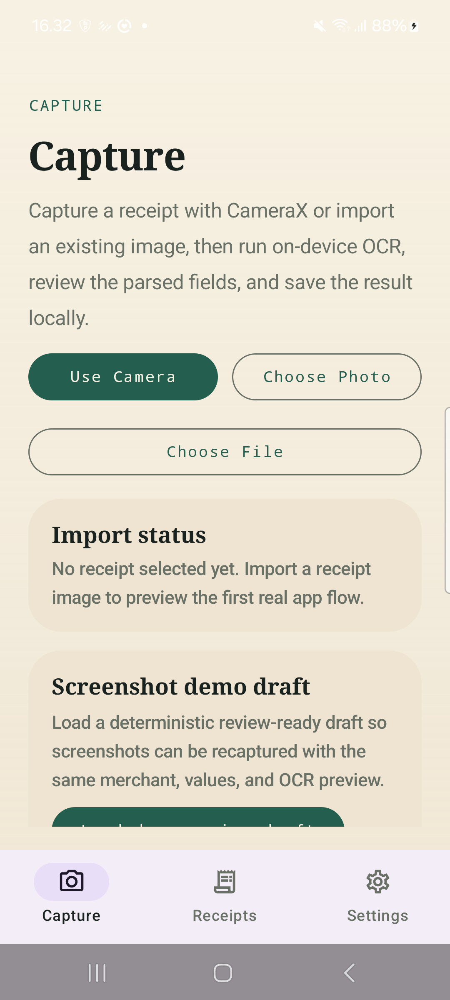
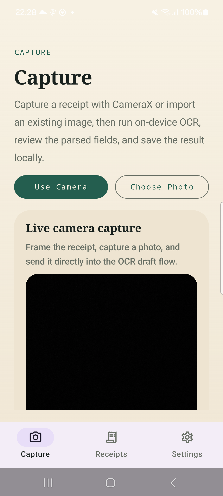
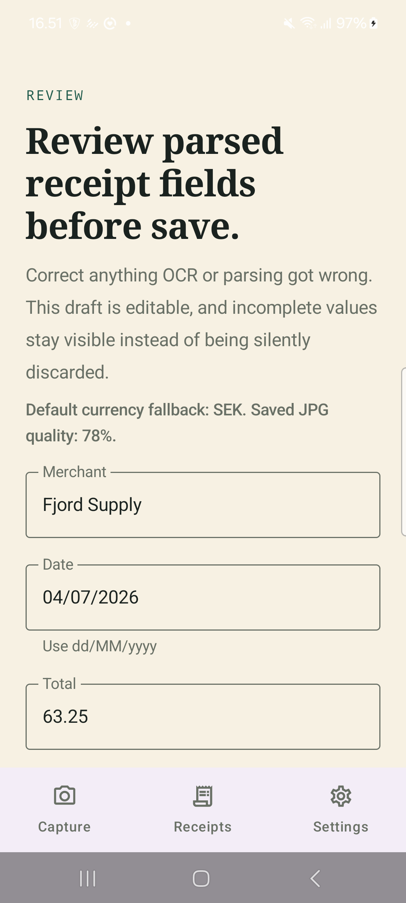
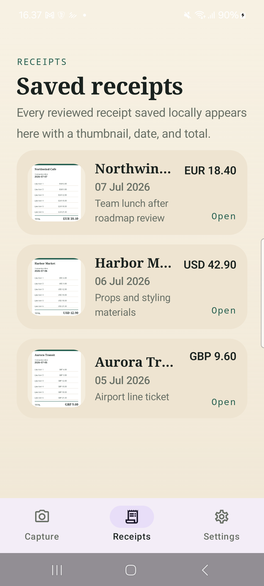
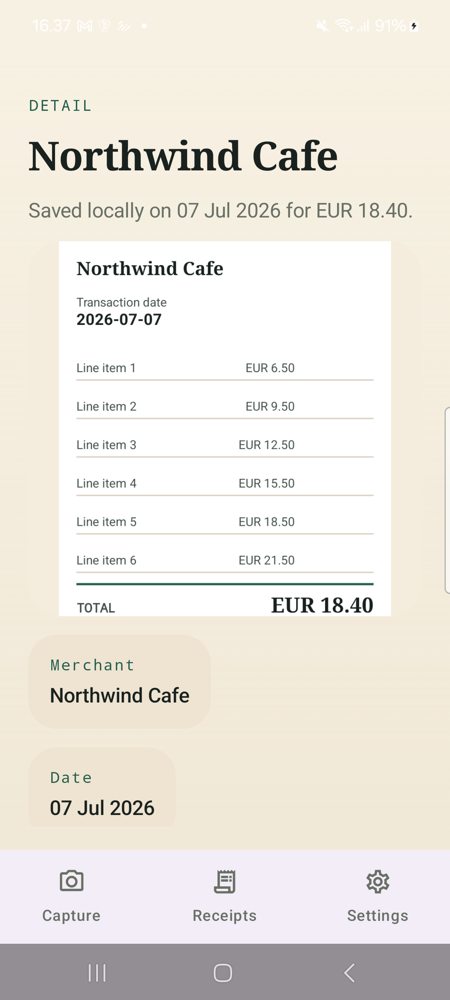
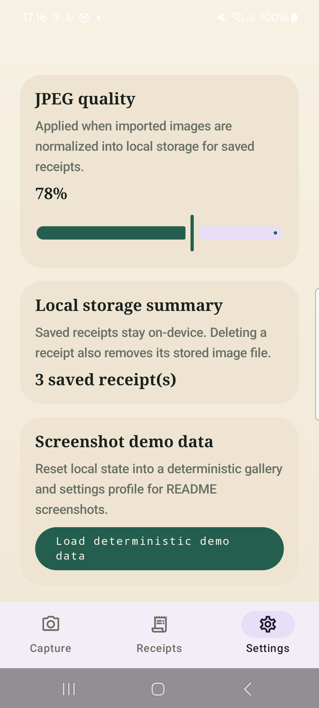

# SnapReceipt

`SnapReceipt` is a local-first Android receipt capture app built as a showcase-quality sibling to the finished iOS version in this repository.

It scans or imports receipt images, runs on-device OCR with ML Kit, parses structured fields deterministically, lets the user correct the draft, and saves the final receipt locally with its stored image.

## Product Overview

The app is designed to demonstrate a complete Android workflow rather than a parser demo or UI mock:

- CameraX capture on phone-sized devices
- Photo Picker and file import support
- on-device OCR with no API keys or backend
- editable review before persistence
- Room-backed receipt history and detail views
- local image storage with cleanup on delete
- persisted settings that affect the live save flow
- deterministic demo data for screenshots and portfolio presentation

## Screenshot Gallery

### Capture




### Review And Save



### Saved Receipts




### Settings



## Feature Summary

- Capture a receipt with CameraX and send the image directly into the OCR draft flow
- Import receipt images from Android Photo Picker or the file picker
- Run text recognition locally with ML Kit Text Recognition
- Parse merchant, date, total, and currency with deterministic heuristics
- Review and edit parsed fields before anything is saved
- Persist receipts to Room and store normalized images in app-private storage
- Browse receipts, inspect details, and delete records with file cleanup
- Persist default currency and JPEG quality with DataStore
- Seed deterministic demo content for screenshots and repeatable showcase states

## Architecture

- Kotlin
- Jetpack Compose
- Material 3
- single-activity app with Navigation Compose
- `ViewModel` + `StateFlow`
- Room for receipt metadata
- DataStore Preferences for settings
- CameraX for capture
- ML Kit Text Recognition for OCR
- app-private file storage for saved images

### Main Flow

1. Open `Capture`.
2. Capture or import a receipt image.
3. Run OCR locally on-device.
4. Parse the draft into merchant, date, total, and currency fields.
5. Review and edit the draft.
6. Save the final receipt locally.
7. Browse the result in `Receipts` and open `Detail`.

## Local-First Tradeoffs

- OCR is fully local, so the core loop works without secrets or a backend.
- Parsing is heuristic and deterministic rather than ML-classifier-driven, which keeps behavior inspectable and testable.
- Receipt images are stored privately on-device, which simplifies privacy and cleanup but intentionally skips sync/export concerns.
- Manual factories were kept instead of adding DI infrastructure because the app scope does not yet justify Hilt.

## Verification

Build and test commands:

```bash
./gradlew :app:assembleDebug
./gradlew :app:testDebugUnitTest
./gradlew :app:compileDebugAndroidTestKotlin
```

Physical-device verification completed on a Samsung `SM_A528B` (`R5CT41HESJV`).

Verified manually:

- capture screen on a phone-sized layout
- CameraX permission and live preview flow
- OCR draft generation and review handoff
- local save flow
- receipts list and detail navigation
- delete flow with local cleanup
- persisted settings behavior across relaunch

Instrumentation status:

- `adb shell am instrument -w -r com.pekomon.snapreceipt.test/androidx.test.runner.AndroidJUnitRunner`
- latest device run passed with `OK (7 tests)`

## Project Notes

- The screenshot set lives in `docs/screenshots/`.
- The local planning file is `../SNAPRECEIPT_ANDROID_PLAN.md` and is intentionally not committed.
