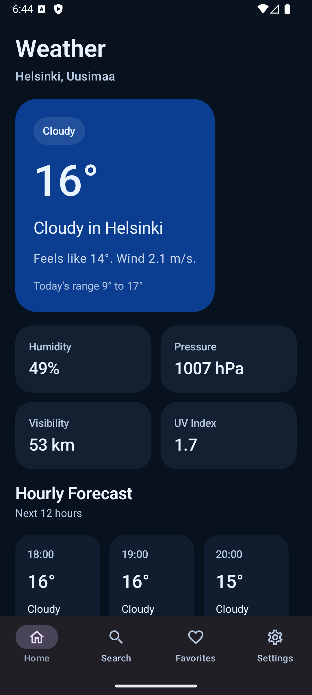
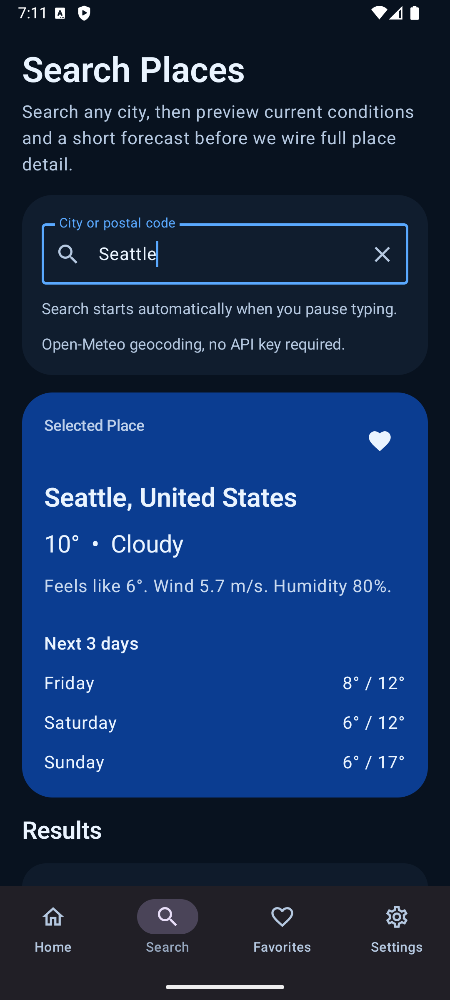
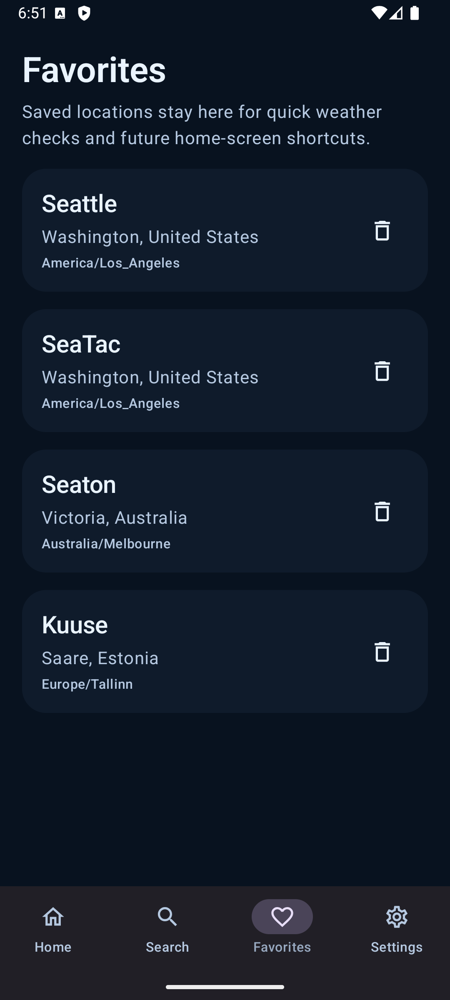
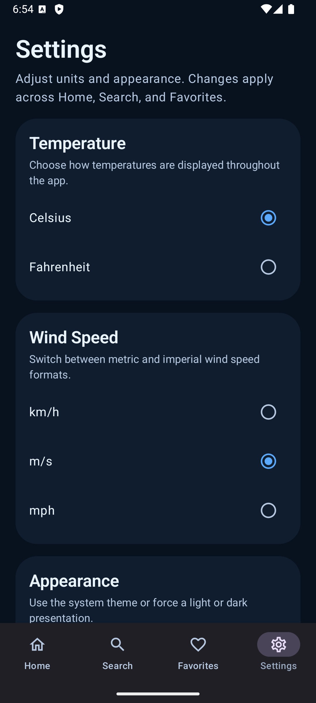

# Weatherly

`Weatherly` is a modern Android weather showcase app built with Kotlin and Jetpack Compose.

It focuses on a polished single-activity Compose architecture, real weather data, adaptive layouts, persistent favorites and settings, and a Glance home screen widget.

## Highlights

- Current weather, hourly forecast, and daily forecast from Open-Meteo
- Place search with Open-Meteo geocoding
- Persistent favorites with quick weather preview
- Persistent settings for temperature unit, wind speed unit, and appearance mode
- Adaptive layouts for wider screens
- Glance-based home screen widget
- Custom adaptive launcher icon

## Screenshots

| Home | Search |
| --- | --- |
|  |  |

| Favorites | Settings |
| --- | --- |
|  |  |

## Tech Stack

- Kotlin
- Jetpack Compose
- Material 3
- Navigation Compose
- AndroidX DataStore
- Glance App Widget
- Official Android Gradle Plugin / Gradle wrapper setup
- Open-Meteo weather and geocoding APIs

## Feature Overview

### Home

- Loads current weather for the app’s current home location
- Shows current conditions, metrics, hourly forecast, and daily forecast
- Reacts to settings changes for units and appearance

### Search

- Searches places against Open-Meteo geocoding
- Starts searching automatically while typing
- Shows a selected-place weather preview
- Supports adding and removing favorites directly from results and preview

### Favorites

- Stores saved places locally with DataStore
- Persists across app restarts
- Lets you open a quick weather preview for each saved place

### Settings

- Temperature unit: Celsius / Fahrenheit
- Wind speed unit: km/h / m/s / mph
- Appearance mode: System / Light / Dark

### Widget

- Glance home screen widget for the current weather summary
- Reuses the app’s weather data and unit formatting

## Architecture Notes

The app is organized around a small set of feature screens and repository-backed data sources:

- `feature/home`
- `feature/search`
- `feature/favorites`
- `feature/settings`
- `data/remote` for Open-Meteo API access
- `data/repository` for weather, search, favorites, and settings persistence
- `core/model` and `core/ui` for shared models and formatting

Open-Meteo response mapping is kept separate from network I/O so forecast and geocoding conversion can be tested without making API requests.

The UI is intentionally phone-first but includes adaptive behavior for larger widths:

- bottom navigation on compact widths
- navigation rail on wider layouts
- list/detail style splits for Search and Favorites
- split forecast layout on Home

## Verification

Validated on `2026-07-24`:

- `./gradlew :app:testDebugUnitTest :app:assembleDebug :app:compileDebugAndroidTestKotlin`
- `./gradlew :app:connectedDebugAndroidTest`
- `rg "com\\.example" . --glob '!**/build/**' --glob '!**/.gradle/**' --glob '!**/.idea/**'`
- Debug APK launch on `emulator-5554` / `Medium_Phone_API_36.0`

Coverage now includes:

- weather formatting
- Open-Meteo forecast and geocoding mapping
- Home, Search, and Favorites ViewModel states
- Home, Search, Favorites, Settings, and top-level navigation Compose coverage

## Notes

- The app currently uses a fixed home location for the main Home weather flow.
- It is designed as a public showcase app, so it uses Open-Meteo to avoid API keys and backend complexity.
